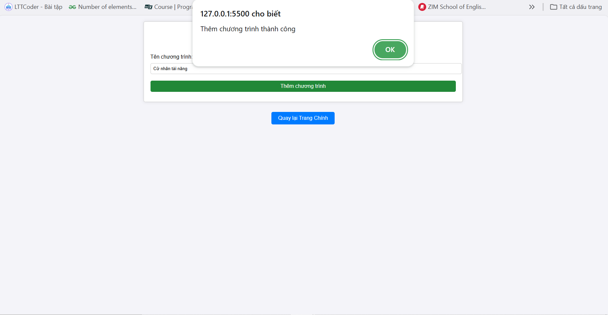
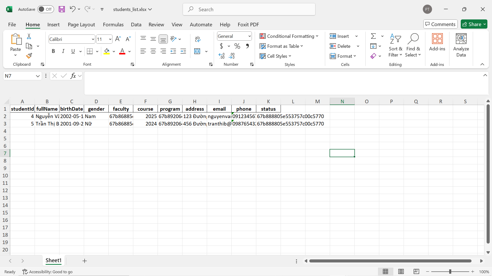

## Version 1.0
### Frontend: folder page

- home.html: Trang chủ của ứng dụng với các liên kết đến các trang tìm kiếm, thêm sinh viên, xóa sinh viên, cập nhật sinh viên.
- searchStudent.html: Tìm kiếm sinh viên theo MSSV.
- addStudent.html: Thêm sinh viên.
- deleteStudent.html: xóa sinh viên theo MSSV.
- updateStudent.html: cập nhât sinh vien theo MSSV.
- styles.css: CSS dùng cho giao diện.

### Backend: folder source
Dùng NestJS, TypeScript và mongoDB 
- controller: Chứa các controller, định nghĩa các endpoint để xử lý các yêu cầu từ frontend.
- service: Chứa các logic xử lý dữ liệu như tạo sinh viên, cập nhật, xóa, và tìm kiếm sinh viên.
- schema: Định nghĩa các schema của MongoDB cho sinh viên.
- dto: Data Transfer Objects dùng để xác định cấu trúc dữ liệu khi nhận hoặc trả về dữ liệu.

### Database:
- Sử dụng MongoDB để lưu trữ dữ liệu
  
### Ảnh: folder screenshots Chứa hình ảnh minh chứng
- Trang chủ

- Giao diện thêm sinh viên mới

- Thêm sinh viên mới

- Giao diện xóa sinh viên

- Xóa sinh viên

- Giao diện tìm kiếm sinh viên

- Tìm kiếm sinh viên

- Giao diên cập nhật sinh viên

- Cập nhật sinh viên

## Cài Đặt và Chạy Ứng Dụng

### 1. Cài Đặt Backend

   - Điều hướng vào thư mục `backend`:
     cd student-management

     npm install

1. **Chạy Backend**:
   - Sử dụng lệnh sau để chạy ứng dụng backend:
     npm run start
   - Web sẽ được chạy trên `http://localhost:3000`.

### 2. **Cài Đặt Frontend**

1. Chỉ cần mở file `home.html` 
2. Go Live để chạy trang home. 

## Version 2.0

### Code
- Thêm các bảng faculty, status, program để có thể thêm hoặc thay đổi tên khoa, chương trình và trạng thái học sinh.

### Ảnh minh chứng

- Thêm mới khoa 

- Đổi tên khoa

- Thêm trạng thái học sinh

- Đổi trạng thái học sinh

- Thêm mới chương trình đào tạo

- Đổi tên chương trình đào tạo

- Giao diện tìm kiếm

- Tìm kiếm theo khoa
- 
- Tìm kiếm theo tên khoa + tên sinh viên

- File excel, json

- Import file excel

- Import file JSON

- Export file

- Export file excel

- Export file JSON

- Logging mechanism

- Version và ngày build ứng dụng

### Deadline
- Hoàn thành trễ phần tìm kiếm, import/export file excel/JSON, logging mechanism và hiển thị version.